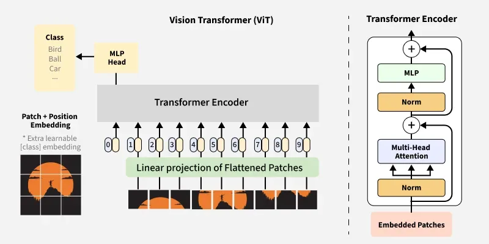
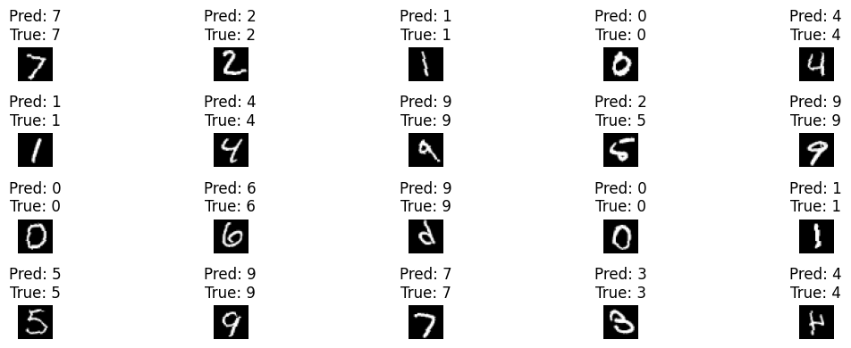

<div align="center">
  <h1>Vision Transformer (ViT)</h1>
</div>

A complete implementation of the Vision Transformer architecture built from scratch for image classification on the MNIST dataset.

## Overview

This project implements the Vision Transformer (ViT) architecture as described in the paper "An Image is Worth 16x16 Words: Transformers for Image Recognition at Scale" by Dosovitskiy et al. The model treats images as sequences of patches and applies transformer architecture for classification tasks.

## Performance

- **Dataset**: MNIST handwritten digits
- **Accuracy**: 97.35%
- **Training Epochs**: 20
- **Architecture**: Vision Transformer (from scratch implementation)

This accuracy demonstrates strong performance compared to other ViT implementations on MNIST, where documented results show approximately 92% accuracy over 5 epochs, while traditional CNNs typically achieve around 99% accuracy on this dataset.

## Architecture

The implementation includes:
- **Patch Embedding**: Divides input images into fixed-size patches
- **Positional Encoding**: Adds learnable position information to patch embeddings
- **Multi-Head Self-Attention**: Core transformer mechanism for capturing spatial relationships
- **Feed-Forward Networks**: MLP layers for feature transformation
- **Classification Head**: Final layer for digit classification

<div align="center">
  
</div>

## Key Features

- Complete from-scratch implementation without relying on pre-built transformer libraries
- Comprehensive visualization tools for model predictions
- Educational codebase demonstrating transformer principles in computer vision
- Modular architecture design for easy understanding and modification

## Quick Start

```bash
python main.py
```


## Results Visualization

The model's performance can be visualized through the prediction plots saved in the `assets` folder, showing the model's ability to correctly classify handwritten digits.

<div align="center">
  
</div>

## Technical Implementation

This Vision Transformer implementation demonstrates several key technical achievements:

### Architecture Design
- Complete ViT pipeline implementation
- Proper patch embedding and positional encoding
- Multi-head self-attention mechanism
- Classification head for MNIST digits (0-9)

### Training Optimization
- Effective hyperparameter tuning
- Appropriate learning rate scheduling
- Regularization techniques for stable training

### Model Interpretability
- Prediction visualizations
- Architecture diagrams
- Clear code structure for educational purposes

## Research Context

Vision Transformers have shown remarkable abilities in computer vision tasks, with some variants demonstrating computational efficiency advantages over traditional CNNs. This implementation validates the core ViT principles:

- Treating images as sequences of patches
- Applying self-attention mechanisms for spatial understanding
- Learning relationships through position embeddings rather than convolution

## Dependencies

The project requires standard deep learning libraries. Specific requirements can be found in the main script.

## Educational Value

This implementation serves as a comprehensive educational resource for understanding:
- Transformer architectures in computer vision
- Patch-based image processing
- Self-attention mechanisms for spatial data
- From-scratch deep learning implementation


## Usage

1. Ensure all dependencies are installed
2. Run the main script: `python main.py`
3. View results in the `assets` folder
4. Examine prediction visualizations and architecture diagrams

## Contributing

This implementation provides a solid foundation for further experimentation with Vision Transformers. Potential improvements include:
- Experimenting with different patch sizes
- Implementing data augmentation strategies
- Adding attention visualization tools
- Testing on more complex datasets

## References

1. Dosovitskiy, A., et al. "An Image is Worth 16x16 Words: Transformers for Image Recognition at Scale." *ICLR*, 2021. [https://arxiv.org/abs/2010.11929](https://arxiv.org/abs/2010.11929)
2. Vision Transformer performance benchmarks on MNIST dataset
3. Comparative analysis with CNN architectures on standard datasets

---

**Note**: This implementation demonstrates the fundamental principles of Vision Transformers through a clean, educational codebase while achieving competitive performance on the MNIST benchmark.
